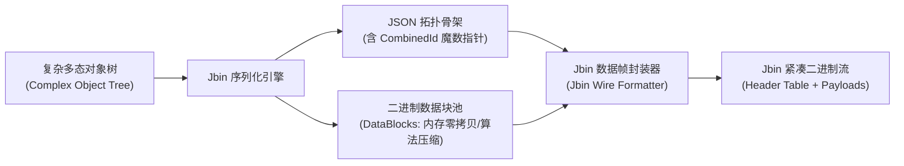
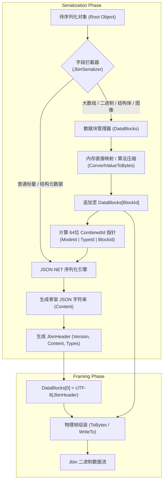
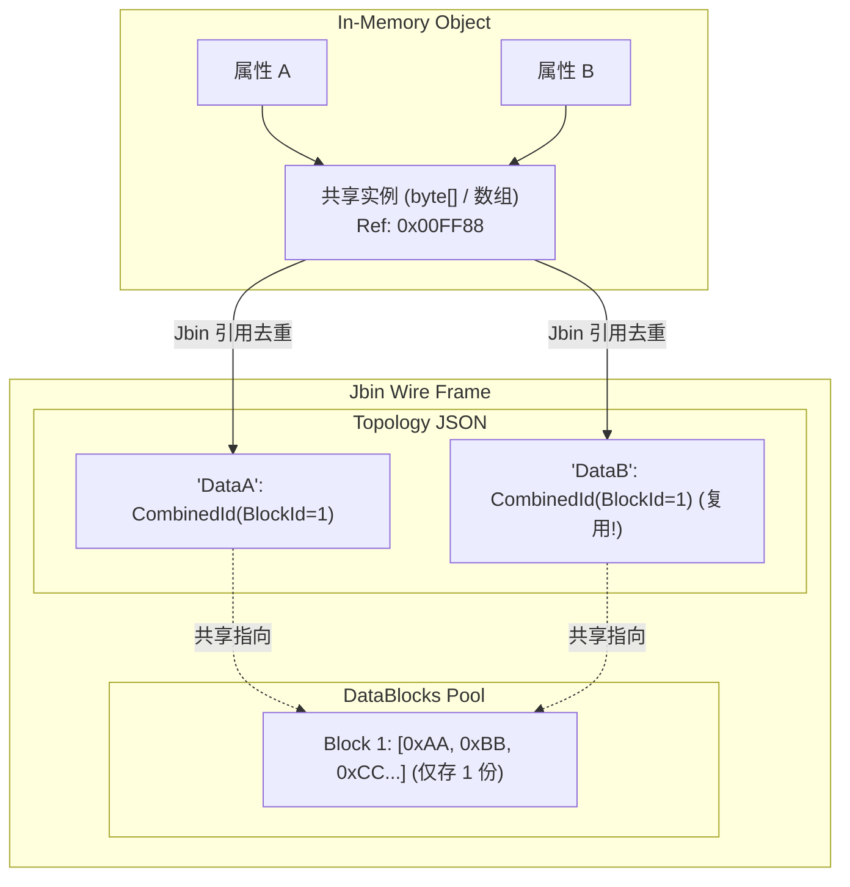
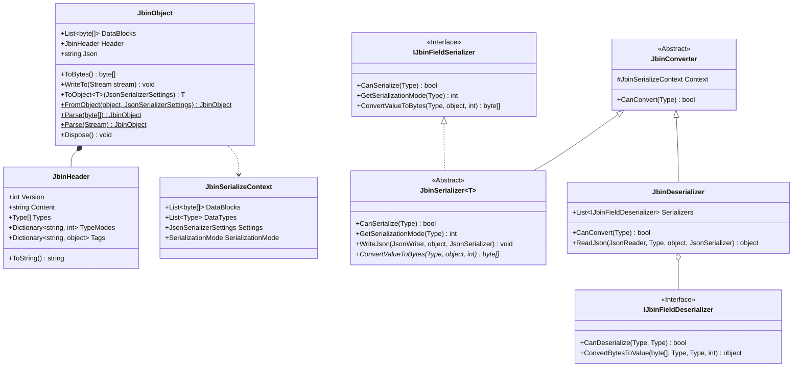
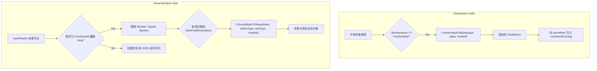
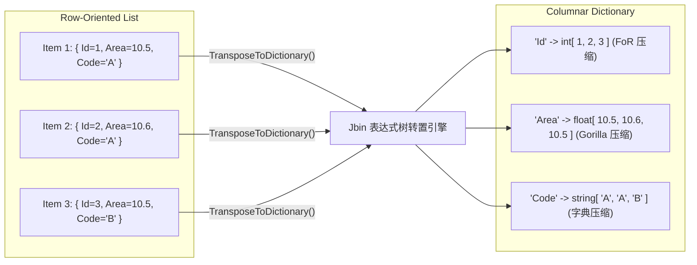
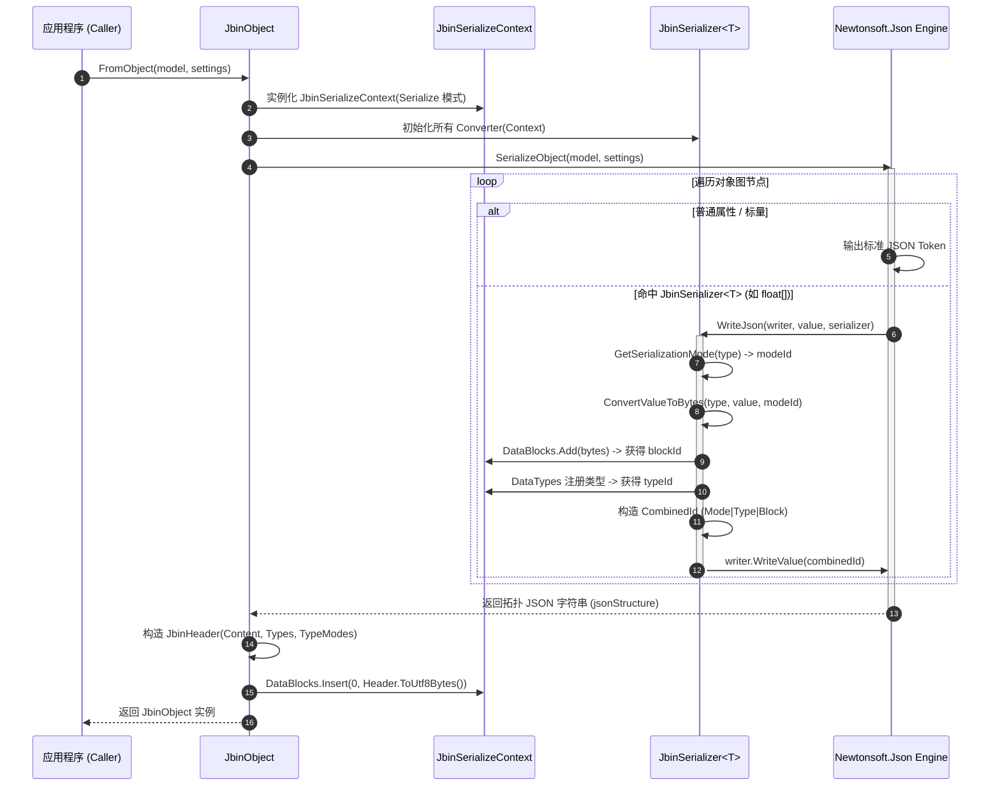
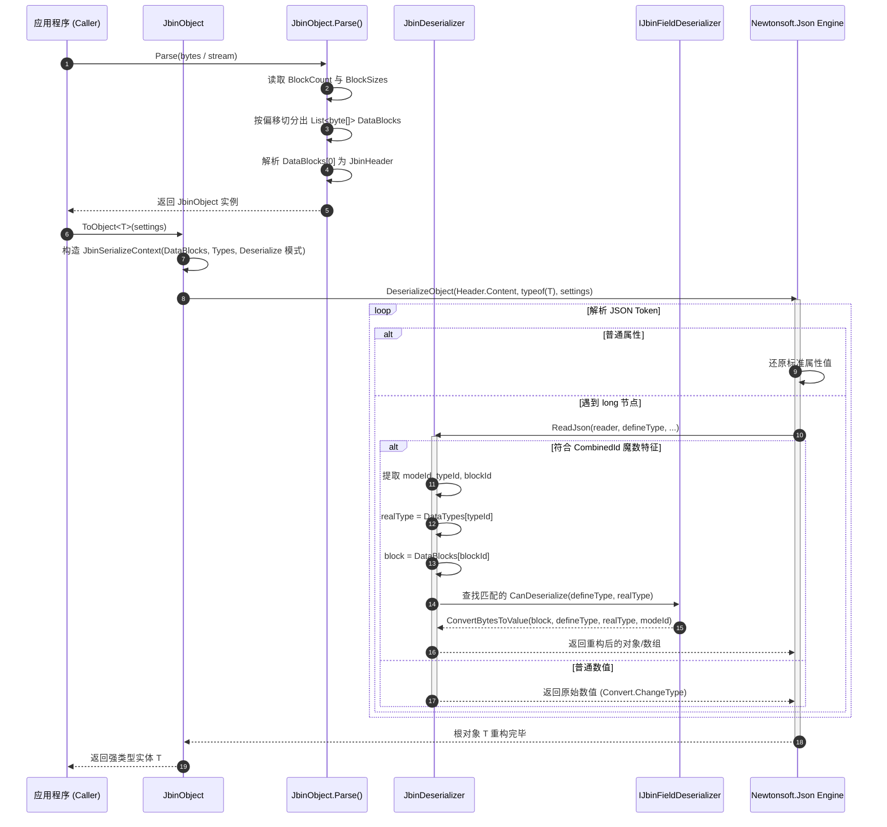

# Jbin 混合二进制序列化协议技术白皮书

---

## 1. 概述与核心摘要

**Jbin**（JSON Binary Hybrid Serialization Protocol）是专为工业物联网、机器视觉、高速数据采集及高性能分布式 RPC 场景设计的**混合型二进制序列化框架**。

在现代高吞吐计算与分布式通信中，开发团队长期面临两难权衡：
1. **纯文本协议（如 JSON / XML）**：具备极强的可读性、灵活的动态对象拓扑表达能力与完善的多态继承支持，但在传输大容量连续基元数组（如传感器波形、点云、图像像素、特征向量）时，面临严重的 Base64 编码体积膨胀（膨胀率约 33%~400%）与高昂的字符串编解码 CPU 开销；
2. **纯二进制协议（如 Protocol Buffers / FlatBuffers / MessagePack）**：具备高压缩比与高序列化吞吐量，但强依赖严格预编译的 Schema（IDL），在表达高度动态的非结构化对象图、多态继承树、弱类型字典以及运行时自定义列式转置时灵活性受限。

**Jbin 创新性地提出了“JSON 拓扑骨架 + 连续二进制数据块池 + 64位魔数位域指针”的混合序列化模型**。该模型将对象树的拓扑关系交由轻量 JSON 处理，将密集负载（Payload）剥离为独立的连续内存二进制块（DataBlocks），并通过位压缩算法（Gorilla、FoR、Simple-8b、Delta-BitPacking、字典索引等）实现高效压缩与自适应解包。Jbin 兼具了 JSON 的通用灵活性与二进制协议的极限吞吐性能。



---

## 2. 设计背景与技术目标

### 2.1 工业与计算密集型场景的序列化痛点

在工业缺陷检测、半导体量测、高频传感器时序采集等实际生产环境中，单次传输的对象模型往往具有以下特征：
- **混合异构性**：既包含描述业务的结构化元数据（批次号、检测参数、工步配置、设备状态枚举），又包含大体积的原始检测数据（百万级浮点点云、高精度波形采样、缺陷图像像素矩阵、特征标签列表）；
- **动态多态性**：检测结果往往基于基类/接口派生出多种异构结果实体（如 `DefectRecord` -> `ScratchDefect`, `DustDefect`, `OpticalDefect`），要求序列化协议能无缝保留派生类类型并安全反序列化；
- **内存敏感与 GC 压力**：高频创建数兆乃至数十兆的字符串和中间缓冲，将导致 .NET 大对象堆（LOH）严重碎片化并频繁触发 GC 停顿（Stop-The-World）。

### 2.2 Jbin 的核心设计目标

1. **结构与负载分离（Decoupled Topology & Payload）**：
   通过元数据与密集数据的物理隔离，消除数值转字符串与 Base64 编解码损耗，实现连续内存块的高效拷贝（Direct Memory BlockCopy）。
2. **免 IDL 编译且支持完全动态多态（Schema-less Polymorphic Safety）**：
   无需 `.proto` 等中间描述语言编译，无缝兼容 C# 原生面向对象类型系统，支持运行时对象拓扑与基于白名单的安全多态解析。
3. **多模式自适应算法压缩（Adaptive Multi-Mode Compression）**：
   针对不同类型特征（单调递增时序、小动态范围浮点、稀疏整数、重复字符串等），支持无缝挂载领域压缩算法（如 Gorilla、Frame of Reference、Simple-8b、Delta+BitPacking、Deflate），并通过协议头自适应解压。
4. **内置高性能行列转置引擎（High-Performance Columnar Engine）**：
   集成基于表达式树（Expression Tree）编译的高性能行列转置（Row-to-Column Transposition），将对象集合转换为列式存储，进一步成倍提升压缩比与传输效率。
5. **流式与零额外内存开销（Stream-Oriented & Zero-Redundant Allocations）**：
   支持直接流式读写，具备清晰确定的内存生命周期管理机制（`IDisposable`）。

---

## 3. Jbin 核心原理与设计思路

### 3.1 混合序列化架构原理

Jbin 的底层工作机理可概括为：**“拓扑提取、指针占位、二进制块外置、单帧聚合”**。



### 3.2 物理传输帧布局 (Binary Wire Format)

Jbin 采用紧凑的物理二进制结构，全局包含**块计数区**、**块大小索引区**以及**连续块数据区**。

```
+---------------------------------------------------------------------------------------+
|                                    Jbin Wire Format                                   |
+-------------------+-----------------------------------+-------------------------------+
|  BlockCount (4B)  |  BlockSize_0 (4B) ... Size_N (4B) | BlockData_0 ... BlockData_N   |
|     (uint32)      |         (uint32 Array)            |       (Raw Byte Arrays)       |
+-------------------+-----------------------------------+-------------------------------+
                                                                    |
                                        +---------------------------+
                                        |
                                        v
                    +---------------------------------------+
                    |             BlockData_0               |
                    |  (JbinHeader JSON, UTF-8 Encoded)     |
                    +---------------------------------------+
                    | - Version: int                        |
                    | - Content: string (Topology JSON)     |
                    | - Types: Type[] (Registered Types)    |
                    | - TypeModes: Dictionary<string, int>  |
                    | - Tags: Dictionary<string, object>    |
                    +---------------------------------------+
```

#### 物理帧各字段规格：
1. **BlockCount（4 字节，uint32，Little-Endian）**：
   表示当前数据帧包含的数据块总数 $N$（$N \ge 1$）。
2. **BlockSizes Table（$N \times 4$ 字节，uint32 数组）**：
   按序记录 `BlockData[0]` 至 `BlockData[N-1]` 各数据块的实际字节长度。
3. **BlockData Pool（变长字节序列）**：
   - **`BlockData[0]`（协议主头部）**：固定为序列化后的 `JbinHeader` JSON 字符串（UTF-8 编码）。
   - **`BlockData[1]` ~ `BlockData[N-1]`（负载数据块）**：存储各字段的二进制实体（Raw 内存、压缩流、位图流等）。

### 3.3 拓扑指针：CombinedId 64位魔数打包规范

为了在 JSON 骨架中用最小的代价精确标记被剥离到 `DataBlocks` 的数据块，Jbin 设计了一种**64位魔数复合 ID（CombinedId）**。

#### CombinedId 位域划分（Bit-field Layout）：

$$\begin{array}{|c|c|c|c|c|}
\hline
\textbf{Bit 63} & \textbf{Bits 55..62 (8 bits)} & \textbf{Bits 32..54 (23 bits)} & \textbf{Bit 31} & \textbf{Bits 0..30 (31 bits)} \\
\hline
\text{Magic Bit 1} & \text{Mode ID} & \text{Type ID} & \text{Magic Bit 2} & \text{Block ID} \\
\text{(Fixed 1)} & \text{(0 - 255 算法模式)} & \text{(0 - 8,388,607 类型索引)} & \text{(Fixed 1)} & \text{(0 - 2,147,483,647 块索引)} \\
\hline
\end{array}$$

```csharp
// 组合 CombinedId 的位运算实现
long combinedId = ((long)(modeId & 0xFF) << 55) 
                | (((long)typeId & 0x007FFFFF) << 32) 
                | ((uint)blockId & 0x7FFFFFFF);

// 植入双重特征魔数标记
combinedId |= (1L << 63); // 最高位置 1
combinedId |= (1L << 31); // 第 31 位置 1
```

#### 魔数指针的设计优势：
- **碰撞防护（Collision Avoidance）**：通过双标志位（Bit 63 与 Bit 31 同时为 1），可极高概率地区分普通业务 `long` 数值与 Jbin 复合指针；
- **自包含元数据（Self-Contained Metadata）**：单个 64 位整数同时编码了**压缩模式（ModeId）**、**类型定位（TypeId）**和**数据块物理定位（BlockId）**，反序列化时无需额外查表，可实现 $O(1)$ 的即时定位与自适应解压。

### 3.4 零拷贝内存直接映射与高效序列化

对于基元数组（如 `float[]`, `int[]`, `double[]`），Jbin 在 Raw 模式下规避了一切逐元素循环与对象装箱，直接基于底层内存指针与系统调用进行块传输：

```csharp
// 基元类型通过 Buffer.BlockCopy 进行连续高速内存拷贝
Buffer.BlockCopy(array, 0, bytes, 0, length);

// 非托管/结构体类型通过 GCHandle 固定内存地址后执行 Marshal.Copy
var handle = GCHandle.Alloc(array, GCHandleType.Pinned);
try {
    Marshal.Copy(handle.AddrOfPinnedObject(), bytes, 0, length);
} finally {
    handle.Free();
}
```

### 3.5 对象引用复用与 BlockId 共享机制（Reference Deduplication & Graph Preservation）

在复杂的业务对象图中，常常存在多个属性指向同一个堆内存对象（DAG 拓扑）的场景（例如 `Root.DataA` 与 `Root.DataB` 赋值为同一个 `byte[]` 或 `int[]` 实例）。

#### 传统 JSON 的缺陷：
- 传统 JSON 会将同一个对象序列化两遍；
- 反序列化时创建两个完全独立的堆内存实例，破坏了对象的引用同一性（`ReferenceEquals(DataA, DataB) == false`），且导致网络传输体积与内存开销成倍膨胀。

#### Jbin 的解决方案：
Jbin 利用底层物理块天然具备全局唯一 `BlockId` 的特性，在序列化与反序列化时建立了**会话级引用追踪与实例复用机制**：

1. **序列化阶段（引用去重）**：
   在 `JbinSerializeContext` 中维护 `SerializedObjectMap`（基于 `ReferenceEqualityComparer` 地址比较）。当后续属性传入相同对象引用时，直接复用已分配的 `CombinedId`（指向同一个 `BlockId`），不产生冗余数据块，极大压缩传输体积并降低序列化 CPU 损耗；
2. **反序列化阶段（实例复用）**：
   在 `JbinSerializeContext` 中维护 `DeserializedBlockCache`（`BlockId -> Object` 映射）。当再次读取到相同的 `BlockId` 时直接返回已解包的内存实例，完美还原原生对象的引用拓扑同一性；
3. **跨 .NET 版本的宏定义兼容方案（以 .NET 8 为分界线）**：
   通过预编译条件编译指令 `#if NET8_0_OR_GREATER`，在 .NET 8 及更高版本中直接使用高优化的 `System.Collections.Generic.ReferenceEqualityComparer.Instance`；在低版本运行时（.NET Standard 2.0 / .NET Framework 4.5.2 等）中无缝回退至内置的基于 `ReferenceEquals` 与 `RuntimeHelpers.GetHashCode` 实现的专用比较器，确保多目标框架下 100% 行为一致。



---

## 4. 与其他序列化方案的多维度横向对比

下表从工业与高吞吐计算视角，对主流序列化方案进行深入对比：

| 对比维度 | JSON (Text) | BSON | MessagePack | Protocol Buffers (v3) | FlatBuffers | Apache Arrow | **Jbin (混合协议)** |
| :--- | :--- | :--- | :--- | :--- | :--- | :--- | :--- |
| **模式依赖 (Schema Dependency)** | 无模式 (Schema-less) | 无模式 | 无模式 | 强依赖 IDL 预编译 | 强依赖 IDL 预编译 | 依赖 Schema 定义 | **无模式 (Schema-less，自描述)** |
| **大数组/二进制存储效率** | 极低 (Base64 膨胀 33% 或数字串膨胀 300%+) | 中 (内联 Binary 封装) | 较高 (紧凑 Binary 格式) | 较高 (`repeated` 字段序列化有开销) | 高 (内存连续对齐存储) | 极高 (原生列式连续内存) | **极高 (内存直接映射 / 原生连续块存储)** |
| **算法级时序压缩支持** | 无 | 无 | 无 | 无 (仅 Varint / Zigzag) | 无 | 字典编码 / RLE (特定类型) | **内置原生支持 (Gorilla/FoR/Simple-8b/Delta)** |
| **多态与继承支持** | 优秀 (`$type` 支持) | 良好 | 弱 (需手写 Tag 派发) | 弱 (`oneof` 模拟，无真正多态) | 弱 (`union` 模拟) | 无 (面向表格结构) | **优秀 (原生支持全类型多态 + 白名单防御)** |
| **动态弱类型与字典表达** | 极强 | 极强 | 强 | 弱 (仅支持限定类型的 `map`) | 极弱 | 较弱 | **极强 (完美继承 JSON 表达能力与动态属性)** |
| **行列转置与列式存储** | 无原生支持 | 无原生支持 | 无原生支持 | 无原生支持 | 无原生支持 | 原生核心模型 | **原生集成 (基于表达式树编译的行列互转引擎)** |
| **人类可读性与自省能力** | 纯文本，完全可读 | 二进制，需工具解析 | 二进制，需工具解析 | 二进制，不可读（无 schema 无法还原） | 二进制，不可读 | 内存布局，需专业工具 | **半自省 (Header JSON 完整暴露拓扑，便于调试)** |
| **C# 生态整合度** | 原生无缝 | 良好 | 良好 | 需 `protoc` 生成代码 | 需 `flatc` 生成代码 | 需专用 SDK | **高度原生，无侵入，完全兼容 LINQ 与反射** |

### 对比结论分析：
- **相较于 Protobuf / FlatBuffers**：Jbin 规避了繁琐的 IDL 定义与编译链，支持 C# 复杂对象拓扑与运行时多态，同时兼具底层连续内存存储的高吞吐；
- **相较于 MessagePack / BSON**：Jbin 创新性地将“结构”与“大数据”物理分离，使得密集矩阵和时序数据可以直接套用专用时序压缩算法，突破了通用二进制序列化的压缩率极限。

---

## 5. Jbin 体系架构与核心组件

### 5.1 总体架构



### 5.2 核心管理层组件

#### 1. `JbinObject`
- **定位**：Jbin 框架的总入口实体，承载整个数据帧的生命周期管理。
- **职责**：
  - 封装 `DataBlocks` 集合并管理帧级序列化（`ToBytes`, `WriteTo`）与反序列化解析（`Parse`）；
  - 提供默认高性能配置 `JsonSerializerSettings`（内置 `CachedContractResolver` 提升反射契约解析性能）；
  - 实现 `IDisposable` 接口，支持快速清理数据块引用，释放 GC 压力。

#### 2. `JbinHeader`
- **定位**：协议元数据头，序列化后固定存储于 `DataBlocks[0]`。
- **成员**：
  - `Version`：协议版本标识；
  - `Content`：对象树的拓扑 JSON 字符串（其中的密集字段已被替换为 `CombinedId`）；
  - `Types`：参与二进制存储的实体类型清单（`Type[]`）；
  - `TypeModes`：类型与压缩模式映射表；
  - `Tags`：用户自定义扩展字典。

#### 3. `JbinSerializeContext`
- **定位**：单次序列化/反序列化会话的上下文容器。
- **职责**：贯穿所有 Converter，在整个转换链路中线程隔离地共享 `DataBlocks`、`DataTypes`、`Settings` 与 `SerializationMode`。

### 5.3 转换器子系统（Converter Subsystem）

Jbin 的字段处理采用**双向责任链分发模型**：



### 5.4 预置转换器与数据类型支持矩阵

| 转换器类名 | 适用数据类型 | 默认序列化机制 | 支持的高级压缩模式 |
| :--- | :--- | :--- | :--- |
| **`JbinPrimitiveArrayConverter`** | `int[]`, `float[]`, `double[]`, `short[]`, `long[]`, `decimal[]`, `enum[]` 等 | `Buffer.BlockCopy` / `Marshal.Copy` 连续内存拷贝 | - **`int[]`**: FrameOfReference (FoR)<br/>- **`float[]` / `double[]`**: Gorilla 时序压缩<br/>- **`long[]`**: Simple-8b 算法<br/>- **`short[]`**: Delta + BitPacking |
| **`JbinBytesConverter`** | `byte[]`, `byte[][]`, `List<byte[]>` | 原生字节直通 / 多段数据块组装 | 原始分块结构打包 |
| **`JbinGenericStructConverter`** | `Point`, `PointF`, `Size`, `SizeF`, `Color` | 高性能预编译委托转换为固定 4~8 字节内存块 | 紧凑定长二进制映射 |
| **`JbinGenericArrayConverter`** | `T[]`, `List<T>`（`T` 为受支持的结构或二进制类型） | 递归分块打包每个子元素的二进制数据 | 继承子元素的模式支持 |
| **`JbinStringDictArrayConverter`** | `string[]` | 字典去重索引（Dictionary-based Indexing） | - **Mode 0**: 字典去重与偏移索引<br/>- **Mode 1**: Deflate 紧凑流压缩 |
| **`JbinBitmapConverter`** | `System.Drawing.Bitmap` | PNG 紧凑流编码 / 内存位图数据拷贝 | PNG / BMP / GDI+ LockBits 内存块传输 |

### 5.5 扩展与安全层

#### 1. 行列转置引擎 (`JbinExtensions`)
针对包含大量对象实体的集合（如 `List<DefectRecord>`，包含数万条记录），行式存储存在大量的字段名冗余和离散内存碎片。`JbinExtensions` 提供了极速的行列双向转置：
- **行转列（`TransposeToDictionary`）**：利用表达式树预编译生成的 Getter 委托，将 `List<T>` 转为 `Dictionary<string, Array>`，使同类型属性在物理内存中完全连续，为后续的基元数组压缩（如 FoR、Gorilla）创造最佳输入条件；
- **列转行（`TransposeFromDictionary`）**：利用表达式树 Setter 委托将列字典瞬时逆转置回强类型对象数组；
- **特性过滤**：支持通过 `[JbinIgnore]` 与 `[JsonIgnore]` 标记在转置时自动排除非必要属性。



#### 2. 程序集白名单安全绑定器 (`AssemblyWhitelistSerializationBinder`)
针对 JSON 多态反序列化（`$type`）可能带来的远程代码执行（RCE）安全隐患，Jbin 提供了 `AssemblyWhitelistSerializationBinder`，严格限制反序列化时允许加载的程序集与类型白名单，防止恶意构造的 Payload 加载危险类型。

#### 3. RPC 反射适配器 (`JbinRpcReflector`)
无缝将 Jbin 数据帧集成到基于 JSON-RPC 2.0 的分布式通信链路中，自动完成 `JsonRpcRequest` / `JsonRpcResponse` 在二进制流与业务方法反射调用间的转换。

---

## 6. Jbin 工作模式与执行流程

### 6.1 序列化生命周期时序



### 6.2 反序列化生命周期时序



---

## 7. 开发者实战教程：自定义 Converter 开发指南

当系统中引入了特定的非标数据结构（如三维向量、空间矩阵、自研传感器压缩包等），开发者可通过扩展 Jbin 的 Converter 机制实现纳秒级的定制编解码。

### 7.1 Converter 核心接口规范

开发自定义 Converter 需要继承基类并实现关键接口：
- **`JbinSerializer<T>`**：实现通用序列化骨架；
- **`IJbinFieldConverter`**（同时继承 `IJbinFieldSerializer` 与 `IJbinFieldDeserializer`）：定义双向转换逻辑。

#### 核心必须实现的方法：
1. `bool CanSerialize(Type objectType)`：判断是否拦截当前类型的序列化；
2. `bool CanDeserialize(Type defineType, Type realType)`：判断是否拦截当前类型的反序列化；
3. `byte[] ConvertValueToBytes(Type type, object value, int modeId)`：将强类型对象转换为紧凑字节数组；
4. `object ConvertBytesToValue(byte[] bytes, Type defineType, Type realType, int modeId)`：将字节数组还原为强类型对象。

---

### 7.2 实战范例：开发三维空间点云 `Vector3D[]` 自定义 Converter

#### 场景目标：
在三维量测中，存在大量 `Vector3D` 结构体组成的点云数组 `Vector3D[]`。默认 JSON 序列化会将其输出为 `[{"X":1.0,"Y":2.0,"Z":3.0}, ...]`，产生极大的体积开销。我们将开发一个专用 Converter，直接将其映射为连续内存块，并支持模式 1（差分压缩）。

#### 步骤 1：定义目标实体模型
```csharp
using System.Runtime.InteropServices;

namespace MyProject.Models
{
    [StructLayout(LayoutKind.Sequential, Pack = 4)]
    public struct Vector3D
    {
        public float X;
        public float Y;
        public float Z;

        public Vector3D(float x, float y, float z)
        {
            X = x;
            Y = y;
            Z = z;
        }
    }
}
```

#### 步骤 2：实现 `JbinVector3DArrayConverter`
```csharp
using System;
using System.IO;
using System.Runtime.InteropServices;
using ApeFree.Protocols.Json.Jbin;
using MyProject.Models;

namespace MyProject.Converters
{
    /// <summary>
    /// Vector3D 数组的高性能二进制转换器
    /// </summary>
    public class JbinVector3DArrayConverter : JbinSerializer<Vector3D[]>, IJbinFieldConverter
    {
        // 单个结构体的字节大小 (3 * 4 = 12 字节)
        private static readonly int StructSize = Marshal.SizeOf<Vector3D>();

        /// <inheritdoc/>
        public override bool CanSerialize(Type objectType)
        {
            return objectType == typeof(Vector3D[]);
        }

        /// <inheritdoc/>
        public bool CanDeserialize(Type defineType, Type realType)
        {
            return realType == typeof(Vector3D[]);
        }

        /// <inheritdoc/>
        public override int GetSerializationMode(Type objectType)
        {
            // 模式 0: Raw 内存直接映射
            // 模式 1: 自定义差分压缩（可按需扩展）
            return 0; 
        }

        /// <inheritdoc/>
        public override byte[] ConvertValueToBytes(Type type, object value, int modeId)
        {
            if (value == null) return new byte[0];
            var vectors = (Vector3D[])value;

            int byteLength = vectors.Length * StructSize;
            byte[] buffer = new byte[byteLength];

            // 使用 GCHandle 进行非托管内存零拷贝映射
            var handle = GCHandle.Alloc(vectors, GCHandleType.Pinned);
            try
            {
                Marshal.Copy(handle.AddrOfPinnedObject(), buffer, 0, byteLength);
            }
            finally
            {
                handle.Free();
            }

            return buffer;
        }

        /// <inheritdoc/>
        public object ConvertBytesToValue(byte[] bytes, Type defineType, Type realType, int modeId)
        {
            if (bytes == null || bytes.Length == 0) return new Vector3D[0];

            int count = bytes.Length / StructSize;
            var result = new Vector3D[count];

            // 反向快速内存拷贝
            var handle = GCHandle.Alloc(result, GCHandleType.Pinned);
            try
            {
                Marshal.Copy(bytes, 0, handle.AddrOfPinnedObject(), bytes.Length);
            }
            finally
            {
                handle.Free();
            }

            return result;
        }

        public object ConvertBytesToValue(byte[] bytes, Type defineType, Type realType)
        {
            return ConvertBytesToValue(bytes, defineType, realType, 0);
        }
    }
}
```

---

### 7.3 注册与测试验证

```csharp
using System;
using System.Linq;
using ApeFree.Protocols.Json.Jbin;
using MyProject.Converters;
using MyProject.Models;

class Program
{
    static void Main()
    {
        // 1. 构造包含 100,000 个三维坐标的大型点云数据
        var pointCloud = Enumerable.Range(0, 100000)
                                   .Select(i => new Vector3D(i * 0.1f, i * 0.2f, i * 0.3f))
                                   .ToArray();

        // 2. 配置 Jbin 序列化设置并注册自定义 Converter
        var settings = JbinObject.JsonSerializerSettings;
        settings.Converters.Add(new JbinVector3DArrayConverter());

        // 3. 执行序列化
        Console.WriteLine("正在执行 Jbin 序列化...");
        var jbin = JbinObject.FromObject(pointCloud, settings);
        byte[] wireBytes = jbin.ToBytes();

        Console.WriteLine($"点云数据量: {pointCloud.Length} 个三维点");
        Console.WriteLine($"序列化后物理二进制帧大小: {wireBytes.Length / 1024.0:F2} KB");

        // 4. 执行反序列化（自适应解析）
        var parsedJbin = JbinObject.Parse(wireBytes);
        var restoredPointCloud = parsedJbin.ToObject<Vector3D[]>(settings);

        // 5. 校验数据完整性
        Console.WriteLine($"反序列化点数量: {restoredPointCloud.Length}");
        Console.WriteLine($"第 50000 个点坐标校验: X={restoredPointCloud[50000].X}, Y={restoredPointCloud[50000].Y}, Z={restoredPointCloud[50000].Z}");
        Console.WriteLine("数据校验完全一致，序列化测试成功！");
    }
}
```

---

## 8. 安全机制与生产级最佳实践

### 8.1 多态反序列化安全防御

在开放网络或不可信客户端场景下，开启 `TypeNameHandling.All` 可能导致反序列化漏洞。强烈建议在反序列化配置中注入 `AssemblyWhitelistSerializationBinder`：

```csharp
var settings = JbinObject.JsonSerializerSettings;

// 仅允许加载当前业务领域内的受信任程序集
settings.SerializationBinder = new AssemblyWhitelistSerializationBinder(
    typeof(MyProject.Models.Vector3D).Assembly,
    typeof(MyProject.Contracts.IDefect).Assembly
);

var result = jbinObject.ToObject<InspectionReport>(settings);
```

### 8.2 大数据流式传输规范

对于超大文件（超过 100MB），应避免在内存中调用 `ToBytes()` 产生连续大字节数组，推荐使用 `WriteTo(Stream)` 和 `Parse(Stream)`：

```csharp
// 写入文件流
using (var fileStream = new FileStream("huge_dataset.jbin", FileMode.Create, FileAccess.Write, FileShare.None))
{
    jbinObject.WriteTo(fileStream);
}

// 从文件流中流式解析
using (var fileStream = new FileStream("huge_dataset.jbin", FileMode.Open, FileAccess.Read, FileShare.Read))
{
    using (var jbin = JbinObject.Parse(fileStream))
    {
        var data = jbin.ToObject<HugeDataset>();
    }
}
```

### 8.3 内存生命周期管理

`JbinObject` 内部持有指向大连续内存块列表 `DataBlocks` 的引用。在处理高并发传输或批处理循环时，应显式调用 `Dispose()` 或使用 `using` 语句以加速内存释放并防止内存泄漏：

```csharp
using (var jbin = JbinObject.FromObject(largeData))
{
    byte[] payload = jbin.ToBytes();
    networkSocket.Send(payload);
} // 离开作用域时立即清空 DataBlocks 引用
```

---

## 9. 总结与架构展望

Jbin 通过巧妙融合 **“JSON 拓扑自描述能力”** 与 **“物理二进制块连续存储/时序压缩”**，彻底打破了传统文本协议与二进制协议之间的壁垒。它在保留 C# 极高开发效率与对象多态表达力的同时，赋予了系统应对海量密集工业数据的高吞吐性能，是现代化测控系统、机器视觉平台及高性能 RPC 基础设施的理想数据交换协议。
