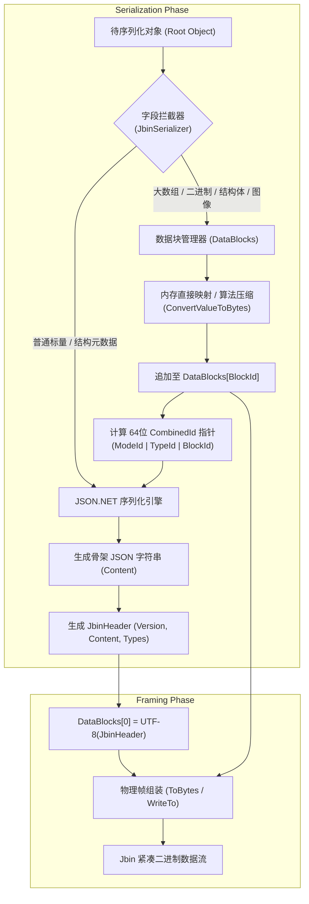

# ApeFree.Protocols.Json

[](https://www.nuget.org/packages/ApeFree.Protocols.Json/)
[](https://www.nuget.org/packages/ApeFree.Protocols.Json/)
[](https://github.com/ApeFree/ApeFree.Protocols/blob/main/LICENSE)
[](https://www.nuget.org/packages/ApeFree.Protocols.Json/)

`ApeFree.Protocols.Json` 是一套专为**工业物联网、机器视觉、高速数据采集与高性能分布式通信**设计的 JSON 衍生与混合序列化协议库。

本项目主要包含两大核心技术组件：
1. **Jbin（JSON Binary Hybrid 混合二进制序列化协议）**：创新性地提出“JSON 拓扑骨架 + 连续二进制数据块池（DataBlocks）+ 64 位魔数指针”的混合模型，彻底解决大容量数值基元数组与二进制数据在传统 JSON 序列化中的 Base64 膨胀与 GC 内存压力，同时完整保留面向对象动态多态特性与免 IDL 编译优势。
2. **JsonRPC 2.0 & JbinRPC 远程调用框架**：遵循标准 JSON-RPC 2.0 协议规范，提供开箱即用的请求/响应实体模型、自动化反射调用引擎（`JsonRpcReflector` / `JbinRpcReflector`）、事件分发与统一多格式（JSON / Jbin）转换适配层。

---

## 目录

- [核心特性](#核心特性)
- [支持平台与环境](#支持平台与环境)
- [安装指南](#安装指南)
- [快速上手](#快速上手)
  - [1. Jbin 基础序列化与反序列化](#1-jbin-基础序列化与反序列化)
  - [2. 工业级多态与密集大数组混合场景](#2-工业级多态与密集大数组混合场景)
  - [3. 表达式树高性能行列转置（列式存储）](#3-表达式树高性能行列转置列式存储)
  - [4. JsonRPC 2.0 请求与响应构造](#4-jsonrpc-20-请求与响应构造)
  - [5. 服务端 RPC 反射与事件分发（JsonRpcReflector / JbinRpcReflector）](#5-服务端-rpc-反射与事件分发jsonrpcreflector--jbinrpcreflector)
  - [6. 多格式统一适配（RpcDataFormat）](#6-多格式统一适配rpcdataformat)
  - [7. 安全反序列化白名单保护](#7-安全反序列化白名单保护)
- [Jbin 体系架构与协议原理](#jbin-体系架构与协议原理)
  - [混合序列化流程](#混合序列化流程)
  - [物理传输帧结构 (Wire Format)](#物理传输帧结构-wire-format)
- [与其他序列化方案对比](#与其他序列化方案对比)
- [核心 API 参考](#核心-api-参考)
- [深入技术文档](#深入技术文档)
- [开源许可证](#开源许可证)

---

## 核心特性

### 🚀 Jbin 混合二进制序列化协议

- **拓扑与密集数据物理解耦**：对象树结构由轻量 JSON 表示，大数组、图像像素、特征向量、连续结构体等密集负载剥离为独立的数据块（`DataBlocks`），彻底免去 Base64 编码体积膨胀（降低 33%~400% 传输开销）。
- **零冗余内存开销与极速吞吐**：基元数组与结构体通过 `Buffer.BlockCopy` 或直接内存映射读写，大幅减少中间字符串分配，避免大对象堆（LOH）碎片化与 GC 频繁停顿。
- **免 IDL 编译且支持完全动态多态**：无需编写与编译 `.proto` 文件，无缝保留 C# 原生类的继承体系与多态特征。
- **多模式领域自适应算法压缩**：
  - 单/双精度浮点时序压缩（**Gorilla** 算法）
  - 32位整数基准帧压缩（**Frame of Reference / FoR** 算法）
  - 64位紧凑整数编码（**Simple-8b** 算法）
  - 16位差分位压缩（**Delta + BitPacking** 算法）
  - 字符串字典去重与 **Deflate** 流压缩
- **表达式树编译的高性能行列转置引擎**：基于 `Expression Tree` 动态编译 Getter/Setter 缓存，毫秒级实现行式对象集合（`List<T>`）与列式字典（`Dictionary<string, Array>`）的双向转置与分组多通道转置。
- **对象引用去重与数据块复用**：自动识别同一对象的多处引用，共享 BlockId，避免重复序列化。
- **确定性资源释放与流式读写**：支持直接面向 `Stream` 读写，实现 `IDisposable` 接口便于精准控制内存生命周期。

### 📡 JsonRPC 2.0 & JbinRPC 远程调用引擎

- **标准 JSON-RPC 2.0 协议规范**：包含 `JsonRpcRequest`、`JsonRpcResponse`、`JsonRpcError`、`JsonRpcErrorCode` 标准实现。
- **自动化方法路由与反射调用**：`JsonRpcReflector` 与 `JbinRpcReflector` 自动分析目标对象方法、匹配方法重载、转换复杂参数类型并安全调用，自动捕获与展开内层异常。
- **事件反射触发**：支持通过 RPC 反射直接触发宿主对象上的 C# 事件（`ReflectRaiseEvent`）。
- **双模格式透明切换**：通过 `RpcDataFormat` 与 `RpcDataFormatExtensions`，一行代码实现 JSON 文本与 Jbin 高性能二进制之间的相互转换。

---

## 支持平台与环境

| 目标框架 | 兼容性说明 |
|---|---|
| **.NET Standard 2.0** | 适用于 .NET Core 2.0+, .NET 5+, .NET Framework 4.6.1+, Mono, Xamarin 等 |
| **.NET 8.0** | 深度优化引用相等比较与现代运行时指令集 |
| **.NET 10.0** | 针对最新 .NET 运行时编译优化 |
| **.NET Framework 4.5.2** | 完美兼容传统工控、WPF/WinForms 遗留工业项目 |

---

## 安装指南

### Package Manager
```powershell
Install-Package ApeFree.Protocols.Json
```

### .NET CLI
```bash
dotnet add package ApeFree.Protocols.Json
```

### PackageReference
```xml
<PackageReference Include="ApeFree.Protocols.Json" Version="0.0.4.0-alpha0829" />
```

---

## 快速上手

### 1. Jbin 基础序列化与反序列化

```csharp
using ApeFree.Protocols.Json.Jbin;
using System;

// 1. 定义包含元数据与密集数据的业务模型
public class SensorTelemetry
{
    public string DeviceId { get; set; }
    public DateTime Timestamp { get; set; }
    public double[] WaveformSampling { get; set; }  // 连续密集浮点采样
    public byte[] RawFrameData { get; set; }        // 原始二进制数据帧
}

var telemetry = new SensorTelemetry
{
    DeviceId = "DEV-SN-90021",
    Timestamp = DateTime.Now,
    WaveformSampling = new double[] { 12.5, 12.6, 12.55, 13.01, 12.98, 12.5 },
    RawFrameData = new byte[] { 0x01, 0x03, 0x00, 0x01, 0x00, 0x02, 0x95, 0xCB }
};

// 2. 序列化为 Jbin 二进制字节数组（或直接写入 Stream）
byte[] jbinBytes = JbinObject.FromObject(telemetry).ToBytes();

// 3. 从二进制字节数组解析并还原为强类型对象
using (JbinObject jbin = JbinObject.Parse(jbinBytes))
{
    var restored = jbin.ToObject<SensorTelemetry>();
    Console.WriteLine($"设备ID: {restored.DeviceId}, 采样点数: {restored.WaveformSampling.Length}");
}
```

---

### 2. 工业级多态与密集大数组混合场景

Jbin 在处理面向对象多态继承体系与工业级大数组时具有极佳的表现，无需任何预编译 Schema：

```csharp
using ApeFree.Protocols.Json.Jbin;
using System.Collections.Generic;

// 基类
public abstract class InspectionDefect
{
    public string DefectId { get; set; }
    public float Confidence { get; set; }
}

// 派生类 A：点云缺陷
public class PointCloudDefect : InspectionDefect
{
    public float[] PointCloudCoordinates { get; set; } // 百万级浮点坐标（内存直接映射拷贝）
}

// 派生类 B：表面划痕图像缺陷
public class ScratchDefect : InspectionDefect
{
    public int ScratchLength { get; set; }
    public byte[] CropImageBuffer { get; set; }         // 二进制图像块
}

// 复杂检测任务报表
public class InspectionReport
{
    public string BatchNo { get; set; }
    public List<InspectionDefect> Defects { get; set; } = new List<InspectionDefect>();
}

// 序列化与反序列化多态对象列表
var report = new InspectionReport
{
    BatchNo = "BATCH-20260829",
    Defects = new List<InspectionDefect>
    {
        new PointCloudDefect { DefectId = "DEF-01", Confidence = 0.98f, PointCloudCoordinates = new float[] { 1.2f, 3.4f, 5.6f } },
        new ScratchDefect { DefectId = "DEF-02", Confidence = 0.95f, ScratchLength = 120, CropImageBuffer = new byte[] { 0xFF, 0xD8, 0xFF } }
    }
};

byte[] reportBytes = JbinObject.FromObject(report).ToBytes();

using (var parsedJbin = JbinObject.Parse(reportBytes))
{
    var restoredReport = parsedJbin.ToObject<InspectionReport>();
    // 派生类型完美保留，多态实例准确反序列化
}
```

---

### 3. 表达式树高性能行列转置（列式存储）

对于大批量对象集合（如时序采集数据），通过列式转置（Row-to-Column Transposition）可以大幅提高数值序列的局部性与压缩比：

```csharp
using ApeFree.Protocols.Json.Jbin.Attributes;
using ApeFree.Protocols.Json.Jbin.Extensions;
using System.Collections.Generic;

public class LogItem
{
    public int Id { get; set; }
    public string Level { get; set; }
    public double Voltage { get; set; }

    [JbinIgnore] // 转置时忽略该字段
    public string TemporaryNote { get; set; }
}

var list = new List<LogItem>
{
    new LogItem { Id = 1, Level = "INFO", Voltage = 220.1 },
    new LogItem { Id = 2, Level = "WARN", Voltage = 220.5 },
    new LogItem { Id = 3, Level = "INFO", Voltage = 219.8 },
};

// 1. 将对象列表转置为列式字典（Key: 属性名, Value: 该属性全量数组）
Dictionary<string, Array> columnDict = list.TransposeToDictionary();
// columnDict["Id"] => int[3] { 1, 2, 3 }
// columnDict["Level"] => string[3] { "INFO", "WARN", "INFO" }
// columnDict["Voltage"] => double[3] { 220.1, 220.5, 219.8 }

// 2. 将列式字典还原为强类型对象数组
LogItem[] restoredArray = columnDict.TransposeFromDictionary<LogItem>();

// 3. 多通道/多分组嵌套转置
var channelData = new Dictionary<string, List<LogItem>>
{
    ["CH1"] = list,
    ["CH2"] = list
};
var transposedChannels = channelData.Transpose(); // Dictionary<string, Dictionary<string, Array>>
```

---

### 4. JsonRPC 2.0 请求与响应构造

```csharp
using ApeFree.Protocols.Json.JsonRpc;
using System;

// 构造标准 JsonRPC 2.0 请求
var request = new JsonRpcRequest
{
    JsonRpc = "2.0",
    Method = "CalculateSum",
    Params = new object[] { 100, 200 },
    Id = 1001
};

// 序列化为规范 JSON 文本
string requestJson = request.ToJsonString();
Console.WriteLine(requestJson);

// 构造成功响应
var successResponse = new JsonRpcResponse
{
    JsonRpc = "2.0",
    Result = 300,
    Id = 1001
};

// 构造异常响应
var errorResponse = new JsonRpcResponse
{
    JsonRpc = "2.0",
    Error = new JsonRpcError
    {
        Code = JsonRpcErrorCode.InvalidParams,
        Message = "参数类型不匹配"
    },
    Id = 1001
};
```

---

### 5. 服务端 RPC 反射与事件分发（JsonRpcReflector / JbinRpcReflector）

`JsonRpcReflector` 与 `JbinRpcReflector` 提供了强大的服务端自动化方法调用分发与事件触发机制：

```csharp
using ApeFree.Protocols.Json.Jbin.Reflectors;
using ApeFree.Protocols.Json.JsonRpc;
using ApeFree.Protocols.Json.JsonRpc.Reflectors;
using System;

// 业务服务类
public class DeviceService
{
    public double Add(double a, double b) => a + b;

    public void OnAlarmTriggered(string message, int level)
    {
        Console.WriteLine($"[报警事件] {message}, 等级: {level}");
    }
}

var service = new DeviceService();

// ================= 文本 JSON 模式调用 =================
var jsonReflector = new JsonRpcReflector();
string reqJson = "{\"jsonrpc\":\"2.0\",\"method\":\"Add\",\"params\":[15.5, 4.5],\"id\":1}";
string respJson = jsonReflector.ReflectInvokeMethod(service, reqJson);
Console.WriteLine(respJson); // {"jsonrpc":"2.0","result":20.0,"id":1}

// ================= 高性能 Jbin 二进制模式调用 =================
var jbinReflector = new JbinRpcReflector();
var rpcReq = new JsonRpcRequest { JsonRpc = "2.0", Method = "Add", Params = new object[] { 50, 50 }, Id = 2 };
byte[] jbinReqBytes = RpcDataFormat.Jbin.ConvertRequestObjectToBytes(rpcReq);

// 经过 JbinRpcReflector 反射调用，直接返回 Jbin 编码的二进制结果
byte[] jbinRespBytes = jbinReflector.ReflectInvokeMethod(service, jbinReqBytes);
JsonRpcResponse response = RpcDataFormat.Jbin.ConvertBytesToResponseObject(jbinRespBytes);
Console.WriteLine($"JbinRPC 调用结果: {response.Result}"); // 100.0
```

---

### 6. 多格式统一适配（RpcDataFormat）

通过 `RpcDataFormatExtensions`，调用方可以在文本 JSON 和二进制 Jbin 之间无缝切换：

```csharp
using ApeFree.Protocols.Json.JsonRpc;

RpcDataFormat format = RpcDataFormat.Jbin; // 或 RpcDataFormat.Json

// 统一将实体序列化为当前格式的字节数组
byte[] dataBytes = format.ConvertRequestObjectToBytes(request);

// 统一从字节数组反序列化为请求实体
JsonRpcRequest parsedReq = format.ConvertBytesToRequestObject(dataBytes);
```

---

### 7. 安全反序列化白名单保护

在多态反序列化（`TypeNameHandling.All`）场景下，为杜绝远程代码执行（RCE）漏洞风险，可使用 `AssemblyWhitelistSerializationBinder` 配置可信程序集与类型白名单：

```csharp
using ApeFree.Protocols.Json.Jbin.Binders;
using Newtonsoft.Json;

var allowedBinder = new AssemblyWhitelistSerializationBinder(
    "MyApplication.Models",
    "ApeFree.Protocols.Json"
);

var settings = new JsonSerializerSettings
{
    TypeNameHandling = TypeNameHandling.Auto,
    SerializationBinder = allowedBinder
};
```

---

## Jbin 体系架构与协议原理

### 混合序列化流程



### 物理传输帧结构 (Wire Format)

```
+---------------------------------------------------------------------------------------+
|                                    Jbin Wire Format                                   |
+-------------------+-----------------------------------+-------------------------------+
|  BlockCount (4B)  |  BlockSize_0 (4B) ... Size_N (4B) | BlockData_0 ... BlockData_N   |
|     (uint32)      |         (uint32 Array)            |       (Raw Byte Arrays)       |
+-------------------+-----------------------------------+-------------------------------+
                                                                    |
                                        +---------------------------+
                                        |
                                        v
                    +---------------------------------------+
                    |             BlockData_0               |
                    |  (JbinHeader JSON, UTF-8 Encoded)     |
                    +---------------------------------------+
                    | - Version: int                        |
                    | - Content: JSON Structure Skeleton    |
                    | - Types: Fully Qualified Type Names   |
                    +---------------------------------------+
```

---

## 与其他序列化方案对比

| 特性维度 | ApeFree Jbin | 传统 JSON (Newtonsoft / STJ) | Protocol Buffers | MessagePack | FlatBuffers |
|---|---|---|---|---|---|
| **序列化数据形态** | 混合形态（JSON 骨架 + 二进制块） | 纯文本 | 纯二进制 | 纯二进制 | 纯二进制 |
| **大基元数组开销** | 0%（内存直接拷贝 / 压缩） | 33%~400%（Base64 或数值文本膨胀）| 0% | 0% | 0% |
| **IDL 预编译依赖** | ❌ **无需编译**，原生 C# 类 | ❌ 无需编译 | ⚠️ **强依赖** `.proto` 编译 | ❌ 无需编译 | ⚠️ **强依赖** `.fbs` 编译 |
| **原生多态支持** | ✅ **完全支持** | ✅ 完全支持 | ❌ 仅支持 `oneof` 模拟 | ⚠️ 依赖扩展类型标记 | ❌ 仅支持 Union |
| **动态字典/弱类型**| ✅ **完全支持** | ✅ 完全支持 | ❌ 弱类型支持差 | ✅ 支持 | ❌ 不支持 |
| **内置算法压缩** | ✅ **内置** (Gorilla/FoR/Simple8b 等) | ❌ 需整包 Gzip | ❌ 需外挂整包压缩 | ❌ 需外挂整包压缩 | ❌ 不支持 |
| **内存/GC 友好度** | 🟢 **极优**（大幅降低 LOH 碎片）| 🔴 较差（频繁产生大字符串） | 🟢 优 | 🟢 优 | 🟢 极优（零拷贝） |

---

## 核心 API 参考

### `ApeFree.Protocols.Json.Jbin`

| 类名 / 类型 | 说明 |
|---|---|
| `JbinObject` | Jbin 协议核心对象，提供 `FromObject`、`Parse`、`ToBytes`、`WriteTo`、`ToObject<T>` 等核心编解码方法。 |
| `JbinHeader` | Jbin 帧头元数据描述（版本号、JSON 拓扑骨架字符串、数据类型列表等）。 |
| `JbinSerializeContext` | 序列化上下文，维护二进制数据块、类型列表、序列化模式与对象引用缓存。 |
| `AssemblyWhitelistSerializationBinder` | 程序集与类型白名单绑定器，保障多态反序列化安全。 |
| `JbinIgnoreAttribute` | 标记属性/字段在 Jbin 序列化或列式转置时忽略。 |
| `Int32ArrayCompressMode` / `SingleArrayCompressMode` 等 | 领域自适应压缩算法模式枚举（Raw, Gorilla, FoR, Simple8b, DeltaBitPacking 等）。 |

### `ApeFree.Protocols.Json.Jbin.Extensions`

| 类名 / 方法 | 说明 |
|---|---|
| `TransposeToDictionary<T>` | 基于表达式树将实体对象集合转置为列式字典（`Dictionary<string, Array>`）。 |
| `TransposeFromDictionary<T>` | 将列式字典还原转置为强类型对象数组。 |
| `Transpose<K, T>` | 多通道/多分组字典的列式双向转置扩展。 |
| `TransposeDictionariesToDictionary` | 动态弱类型字典列表的列式双向转置扩展。 |
| `ObjectUtils.DeepCopy` | 基于 Jbin 引擎的高性能对象深度拷贝工具。 |

### `ApeFree.Protocols.Json.JsonRpc` & `Reflectors`

| 类名 / 类型 | 说明 |
|---|---|
| `JsonRpcRequest` | 标准 JSON-RPC 2.0 请求实体（包含 `jsonrpc`、`method`、`params`、`id`）。 |
| `JsonRpcResponse` | 标准 JSON-RPC 2.0 响应实体（包含 `jsonrpc`、`result`、`error`、`id`）。 |
| `JsonRpcError` | JSON-RPC 错误描述实体（包含 `code`、`message`、`data`）。 |
| `JsonRpcErrorCode` | JSON-RPC 标准错误代码枚举（`ParseError`, `InvalidRequest`, `MethodNotFound`, `InvalidParams`, `InternalError`）。 |
| `JsonRpcReflector` | 基于文本 JSON 的 RPC 服务端自动化方法路由与事件触发反射器。 |
| `JbinRpcReflector` | 基于 Jbin 高性能二进制协议的 RPC 服务端自动化方法路由与事件触发反射器。 |
| `RpcDataFormat` | RPC 数据格式枚举（`Json` / `Jbin`）。 |
| `RpcDataFormatExtensions` | 请求/响应对象与多格式二进制字节流之间的双向转换扩展方法。 |

---

## 深入技术文档

有关 Jbin 内部 64 位魔数指针算法、物理帧内存布局规范、各压缩算法详细数学原理、Converter 自定义开发教程及性能基准测试，请参阅：
- [Jbin 技术白皮书与开发指南 (Jbin_Technical_Documentation.md)](file:///C:/Users/Administrator/Documents/ApeFree/ApeFree.Protocols/ApeFree.Protocols.Json/Jbin/doc/Jbin_Technical_Documentation.md)

---

## 开源许可证

本项目遵循 [Apache-2.0](https://github.com/ApeFree/ApeFree.Protocols/blob/main/LICENSE) 开源许可证。

Copyright © 2022-2026 ApeFree, All Rights Reserved.
